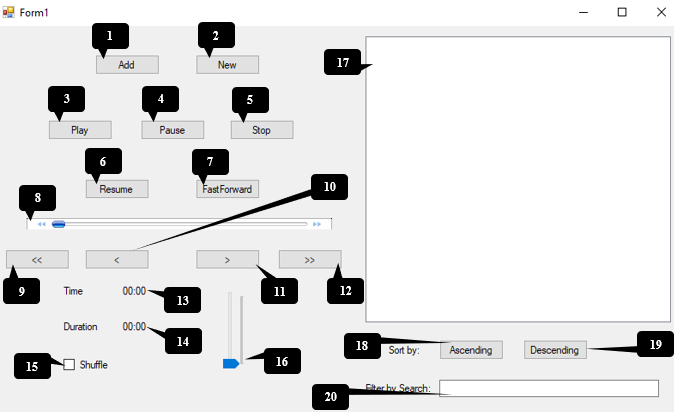

# AntWalk Music-Player

  

 The Initial Box is the interface when you run the code which contains couple of function which are labeled through number. The following label are below:
1.	Add		 				
2.	New
3.	Play
4.	Pause
5.	Stop
6.	Resume
7.	Fast Forward
8.	Progress Bar
9.	First Song
10.	Previous Song
11.	Next Song
12.	Last Song
13.	Time of Music
14.	Duration of Music
15.	Shuffle
16.	Volume Bar
17.	List Box
18.	Sort by Ascending
19.	Sort by Descending 
20.	Search Music

# Code Description
*	For Language: C# Language.
*	For ADT: Queue with Array Implementation.
*	For Search Algorithm: Linear Search.
*	For Sort Algorithm: Bubble Sort.

# Developed by
Antwalk

